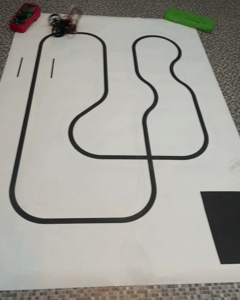

# LineFollower

(De snelheid is niet de effectieve snelheid)
  
## specifications

microcontroller: Esp 32 wroom

motors: N20 micro metal gear motor 600rpm (Pololu)

h-bridge: DRV8833 daul motor driver carrier (Pololu)

sensors: QTR_8RC Reflectance  Sensor (Pololu)

batteries: 2x 18650

wireless communication: Bluetooth (onboard)

distance sensor - motors: 87mm

weight: 134g

speed: 0.6 m/s

